## **PV-RCNN: Point-Voxel Feature Set Abstraction for 3D Object Detection**

### 相关知识

- kitti数据集：[(21条消息) KITTI数据集下载及解析_Michael.CV的博客-CSDN博客](https://blog.csdn.net/u013086672/article/details/103913361)

   

- 稀疏卷积：https://zhuanlan.zhihu.com/p/382365889

  > 点云体素化之后，大多都是3d空间稀疏的，如果用常规卷积算法，计算冗余太多，可以用稀疏卷积，即只计算稀疏点的卷积，3d计算过程和2d类似。
  >
  > 通过对输入输出不为空的数据建立位置哈希表和RuleBook，只对有效数据计算卷积，从而减少计算量。

  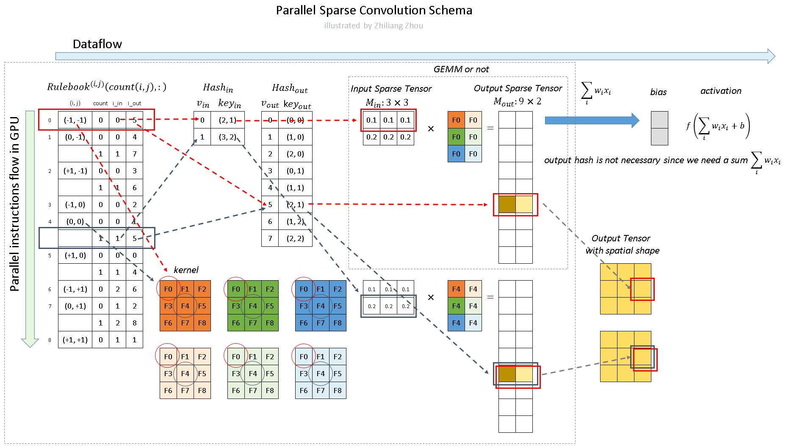

### 流程

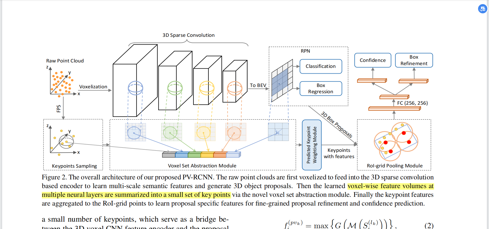

#### RPN

##### 1. 体素化

将点云信息变成固定大小的张量格式，把三维空间根据点云位置放到体素元中。

[(21条消息) 利用PCL点云下采样实现数据体素化_点云体素化_秋水黑刀的博客-CSDN博客](https://blog.csdn.net/CLSWE/article/details/108413320)

##### 2. 3D 稀疏卷积特征提取层

将体素化之后的大小 L W H 通过3D稀疏卷积下采样 1 2 4 8倍数，再8倍特征（BEV brid eye view）上做坐标框和类别回归（RPN）。

#### RCNN

##### 1. keypoints sampling

将原始点云直接FPS（furthest point sampleing）得到2048个关键点。

##### 2. 体素子集提取模块（VSA）

将RPN过程中的不同特征层的体素语义信息和关键点信息融合，包括不同尺度的体素，初始关键点和BEV的体素点。

##### 3. 关键点加权（PKW）

通过ground truth对融合关键点信息进行加权

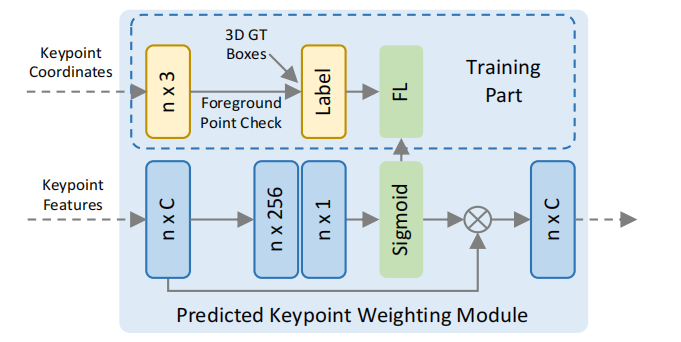

##### 4. RoI-voxel Pooling

通过RPN的proposal，在关键点特征层上进行RoI提取。包括不同尺度的体素（黄色），初始关键点（橙色）和BEV的体素点（红色）。

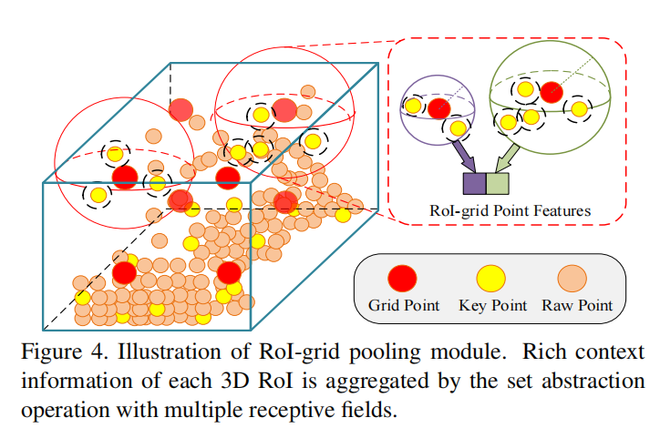

##### 5. 3D Proposal Refifinement and Confifidence Predict

根据RoI提取后的特征，进行MLP得到置信度和坐标框位置（中心、大小、方位）。

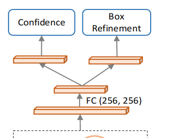

#### Loss

RPN过程的loss，分类loss利用focal loss计算，坐标框loss利用预测回归残差和真实残差的L1 loss：

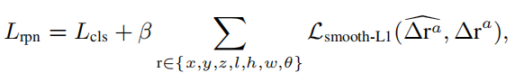

RPN过程的loss，iou loss计算预测框和真实框的iou损失（>0.25 为弱正，>0.5为真正），坐标框loss利用预测回归残差和真实残差的L1 loss：

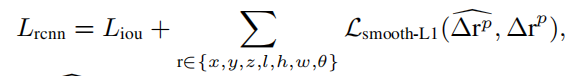

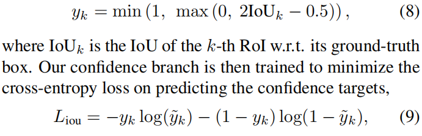

### Experiment

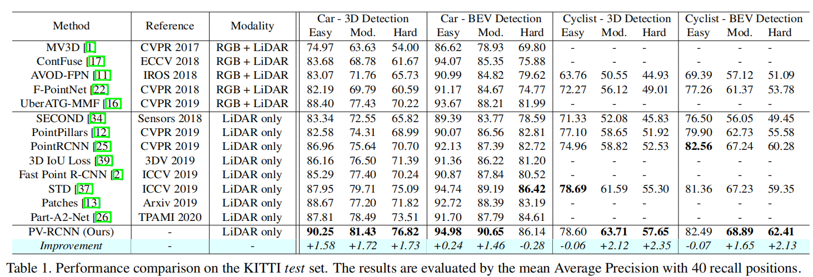

### Ablation

1. 关键点编码 和 RoI Pooling

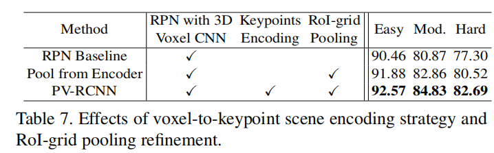

2. RCNN中体素VSA模块

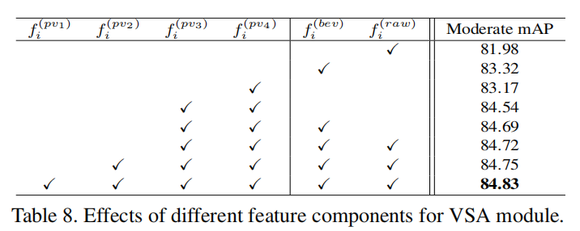

3. PKW & RoIPooling方式 & 置信度预测方式

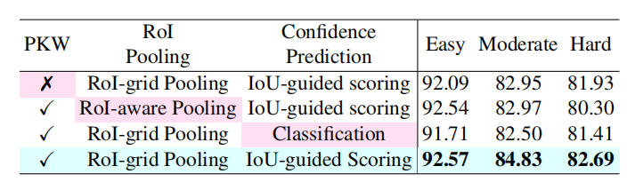