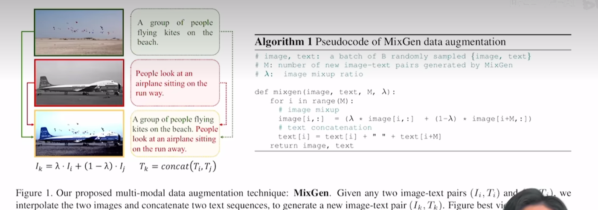

# 大模型时代下的科研

### Efficient(Parameter-Efficient Fine-Tune)

综述：Towards a unified view of parameter-efficient transfer learning

#### 1. Adapter

- Transformer中新加Adapter层，只训练这个层，有时训练成本可以降为原始大模型的万分之一。

#### 2. CoOp(Prompt tuning)

#### 3. VPT(Visual Prompt tuning)

#### 4. huggingface PEFT blog

GPU内存不高，如何使用大模型  https://github.com/huggingface/peft

#### 5. AIM

https://adapt-image-models.github.io/

视频理解的PEFT,参照Adapter。c：空间维度加adapter，d：时序、空间维度加adapter，e：

### Existing Model

#### 1. Object-Centric Learning

### Plug and Play

#### 1. MixGen: data augmentation

### Evaluation\new dataset\survey

#### 1. 目标检测集大成者的数据集

