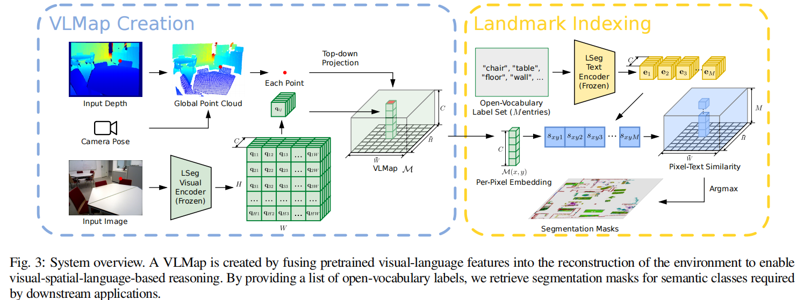
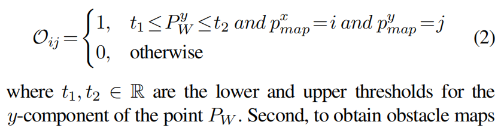
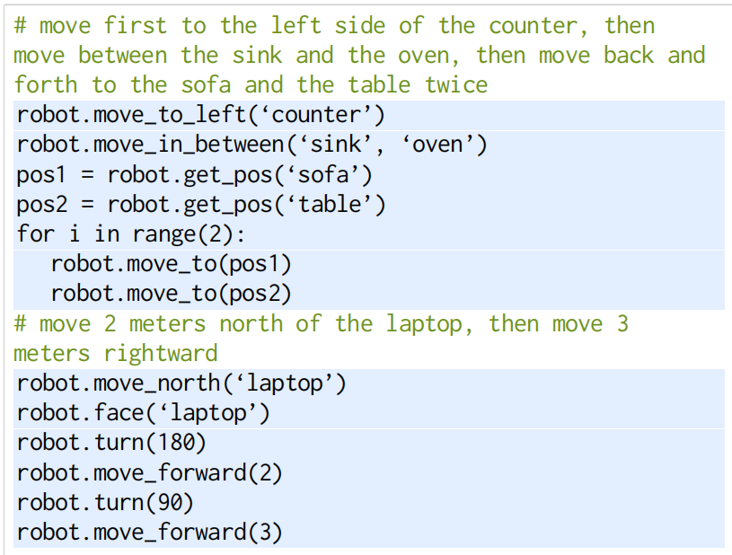
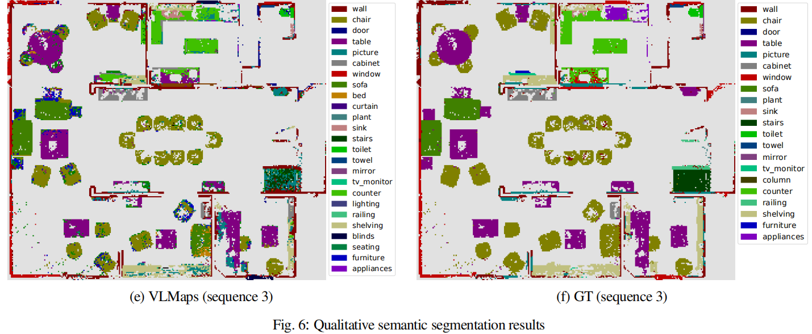

# **Visual Language Maps for Robot Navigation**

### Method

（i）如何构建VLMap（第III-A节），

（ii）如何使用这些地图来定位开放词汇的地标（第III-B节），

（iii）如何根据不同机器人实体的障碍物类别列表构建开放词汇的障碍物地图（第III-C节）

（iv）如何将VLMaps与大型语言模型（LLMs）结合使用，从自然语言命令中进行零样本空间目标导航到真实机器人上（第III-D节），而无需额外的数据收集或模型微调。

#### （i）如何构建VLMap

我们使用LSeg [11]作为视觉语言模型，它是一个以语言驱动的语义分割模型，根据一组自由形式的语言类别对RGB图像进行分割。LSeg视觉编码器将图像映射到使得每个像素的嵌入在CLIP特征空间中的位置。在我们的方法中，我们将LSeg像素嵌入与其对应的3D地图位置融合在一起。通过这种方式，我们在没有显式手动分割标签的情况下，融入了一个强大的以语言驱动的语义先验，继承了VLMs的泛化能力。**我们所做的唯一假设是可以访问里程计信息，这可以从RGB-D SLAM系统中轻松获得，并使我们能够从RGB-D图像序列构建地图。**

#### （ii）定位开放词汇地标点

使用LSeg中的文本编码分支对所有类别提取特征，M表示用户定义的类别数，得到M个C长度特征向量。将上一步得到的像素语义地图（H' X W'）逐一和M个C长度特征向量做相似性，得到相似性地图（H' X W'）。

#### （iii）生成障碍物地图

具体而言，给定用自然语言描述的障碍物类别列表，我们可以在运行时定位这些障碍物，生成用于避免碰撞和/或最短路径规划的二进制地图。这种方法的一个重要用例是在不同具体化（即不同机器人实体）的不同机器人之间共享同一环境的VLMap。

首先，构建障碍物地图O ∈ {0,1} H' X W'，其中点云在天花板或者地面范围之内的点云设置1，其他为0：

之后，通过输入特定实体的障碍物，我们定义了一个潜在障碍物类别列表 Lobs = [lobs0,lobs1,...,lobsM]，其中 lobsi 表示语言中的第i个障碍物类别，M表示用户定义的障碍物类别总数。然后，我们应用第2节中介绍的开放词汇地标索引，为所有定义的障碍物获取分割掩码。

最后，得到的分割掩码和上面的O取交集，得到最终的障碍物地图Oemk。

#### （iiii）零样本空间目标导航

语言模型调用的导航基元函数（例如robot.move_to_left('counter')）使用预生成的VLMap来定位地图中开放词汇的坐标（如“counter”），并通过预定义的脚本偏移量（用于定义“left”）进行修改。然后，我们使用现成的导航栈根据特定机器人体系结构的障碍物地图导航到这些坐标。

> \# move a bit to the right of the fridge
>
> robot.move_to_right(‘refrigerator’)
>
> \# turn right 20 degrees
>
> robot.turn(20)

### EXPERIMENTS

#### （i）实验设置

我们使用Habitat模拟器[45]和Matterport3D数据集[46]来评估多目标和空间目标导航任务。该数据集包含大量真实室内场景，有助于评估导航代理的泛化能力。为了评估创建开放词汇的多体现障碍地图，我们采用了AI2THOR模拟器，因为它支持多种类型的代理，如LoCoBot和无人机。在这两个环境中，机器人需要在连续的环境中进行导航，可执行的动作包括向前移动0.05米、向左旋转1度、向右旋转1度和停止。在Habitat中进行地图创建时，我们收集了来自十个不同场景的12,096个RGB-D帧，并记录了每帧的相机位姿。类似地，在AI2THOR中的十个房间中收集了1,826个RGB-D帧。

#### （ii）真实机器人实验

我们还使用HSR移动机器人进行了现实世界的实验，根据自然语言命令进行室内导航。在地图创建方面，我们记录了评估场景的374帧，并使用现成的RGB-D SLAM解决方案RTAB-Map [49]估计相机位姿。在推理过程中，我们还使用RTAB-Map的全局定位模块初始化机器人的姿态。我们在一个语义丰富的室内场景中测试了VLMaps，该场景中有十多种不同类别的对象。我们定义了20个不同的基于语言的空间目标进行测试。在不同的测试运行中，我们将机器人置于不同的位置。机器人完成了其中的十个导航目标。在成功的试验中，其中六个是空间目标，如“在椅子和木箱之间移动”或“在桌子的南边移动”。其中三个是相对于机器人当前位置的目标，如“向右移动3米，然后向左移动2米”。另一个是带有重复的指令：“在键盘和笔记本电脑之间移动两次”。我们观察到失败的情况是由以下原因引起的：1) 不准确的深度导致地图创建过程中引入噪声，降低了地标索引的准确性；2) 动作噪声会对测试时的导航性能产生负面影响。总体而言，这些结果表明VLMaps能够在现实世界中使用自然语言索引地标，并且更重要的是其适用性，可以实现各种基于语言的开放词汇的空间导航目标。

###  DISCUSSION AND LIMITATIONS

在这项工作中，我们提出了VLMaps，一种通过预训练的视觉语言特征丰富的空间地图表示，它使得地图中可以进行自然语言索引。当与大型语言模型结合使用时，VLMaps可以应用于零样本的空间目标导航，并可以在多个具有不同体现形式的机器人之间共享，以在运行时生成新的障碍物地图。然而，VLMaps也存在一些局限性。特别地，它们对3D重建噪声和导航中的里程漂移非常敏感。当场景中充斥着相似对象时，它们无法解决地标索引过程中的对象模糊性问题。在未来的工作中，我们计划通过使用更好的视觉语言模型来改进VLMaps，并将其扩展到包含动态对象和移动人体的场景中。

