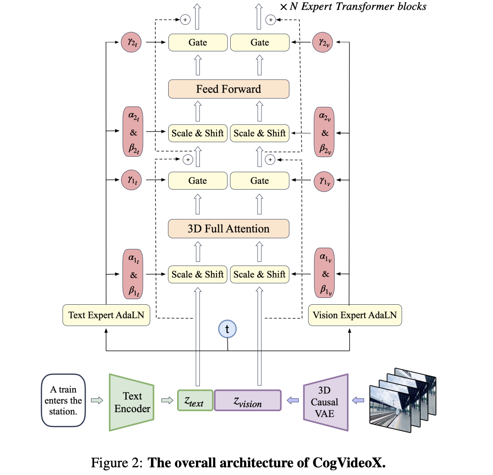
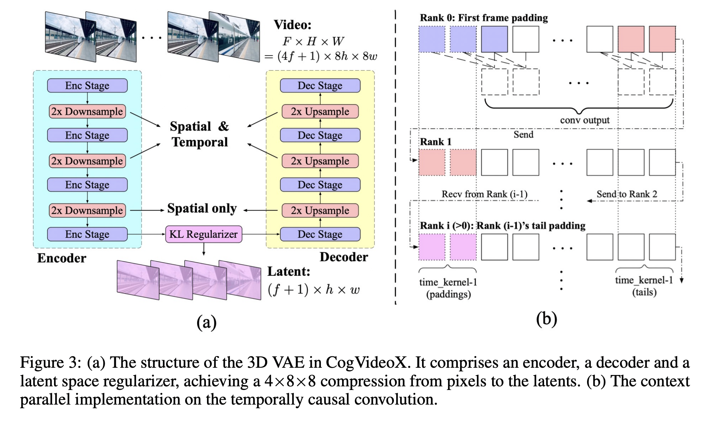
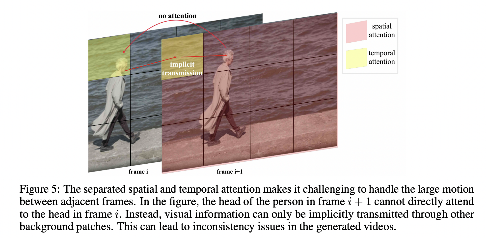

## CogVideoX: Text-to-Video Diffusion Models with An Expert Transformer

智谱，清华  https://github.com/THUDM/CogVideo

### The CogVideoX Architecture

In the section, we present the CogVideoX model. Figure 2 illustrates the overall architecture. Given a pair of video and text input, we design a **3D causal VAE** to compress the video into the latent space, and the latents are then patchified and unfolded into a long sequence denoted as zvision. Simultaneously, we encode the textual input into text embeddings ztext using T5 (Raffel et al., 2020). Subsequently, 2 ztext and zvision are concatenated along the sequence dimension. The concatenated embeddings are then fed into a stack of **expert transformer** blocks. Finally, the model output are unpatchified to restore the original latent shape, which is then decoded using a 3D causal VAE decoder to reconstruct the video. We illustrate the technical design of the 3D causal VAE and expert transfomer in detail.

### 3D VAE和因果卷积

多节点并行方式看下图b，看单节点第1行，先在时序维度上padding2个，然后再kernel为3的情况下得到和输入一样的conv output，其余节点类似处理。This ensures the future information not to influence the present or past predictions.

### Expert Transformer Block

However, the feature spaces of these two modalities differ significantly, and their embeddings may even have different numerical scales. To better process them within the same sequence, we employ the Expert Adaptive Layernorm to handle each modality independently.

### 3D Full Attention.

However, as illustrated in Figure, this separated attention（eg: spatial and temporal attention） approach requires **extensive implicit transmission** of visual information, significantly **increasing the learning complexity** and making it challenging to maintain the consistency of large-movement objects.

we propose a 3D text-video hybrid attention mechanism. This mechanism not only achieves better results but can also be easily adapted to various parallel acceleration methods.

考虑先进行spatial的Attn，再进行temoiral的Attn，输入(B,T),S,C设为1,16,225,1152，进行spatial的Attn的时候，16个帧的225空间的特征进行Attn，学习单帧的空间相互信息。输出的结果rearrage之后，为(B,S),T,C，设为1,225,16,1152，再进行temoiral的Attn，225个空间像素的16个时序的特征进行Attn，学习单像素的时序相互信息。

以上过程对相邻帧间的大幅度运动需要通过2个过程隐式传播学习，很具有挑战，故而直接用3D Full Attn。

### mix images and videos during training——Frame Pack. 

### Resolution Progressive Training

The training pipeline of CogVideoX is divided into three stages: **low-resolution training, highresolution training, and high-quality video fine-tuning.** Similar to images, videos from the Internet usually include a significant amount of low-resolution ones. Progressive training can effectively utilize videos of various resolutions. Moreover, training at low resolution **initially can equip the model with coarse-grained modeling capabilities, followed by high-resolution training to enhance its ability to capture fine details.** Compared to direct high-resolution training, staged training can also help reduce the overall training time.

